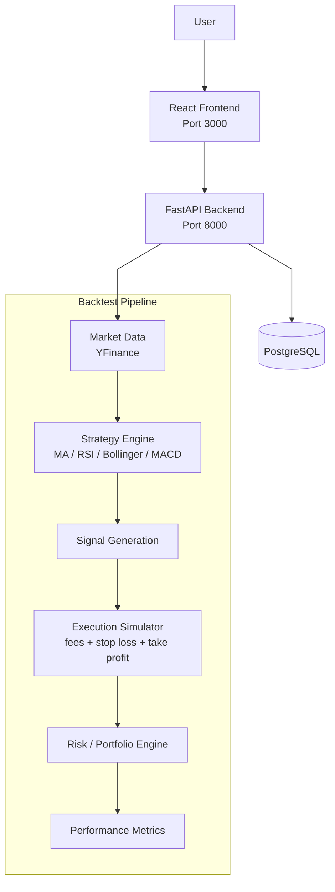

# Algorithmic Trading Backtesting Platform

Algorithmic trading backtesting platform built for evaluating systematic trading strategies on historical market data.

The platform supports configurable strategy pipelines, realistic execution modelling with slippage and transaction costs, portfolio analytics, and interactive performance visualisation through a React dashboard.

Built to explore quantitative trading workflows, risk analysis, and scalable strategy experimentation.

---

## Features

* Modular strategy architecture with pluggable trading strategies
* Historical backtesting engine for systematic strategy evaluation
* Portfolio accounting with:

  * transaction costs
  * slippage simulation
  * position tracking
* Performance analytics including:

  * Sharpe ratio
  * CAGR
  * maximum drawdown
  * cumulative returns
* Interactive React dashboard for:

  * equity curve visualisation
  * strategy comparison
  * parameter experimentation
* REST API backend built with FastAPI
* PostgreSQL integration for persistent storage and analytics

---

## Supported Strategies

Currently implemented strategies include:

* Moving Average Crossover
* RSI Mean Reversion
* Bollinger Bands
* MACD

The system is designed so additional strategies can be added with minimal modification to the core engine.

---

## Why I Built This

Traditional broker tools provide limited flexibility for strategy experimentation and execution modelling. I built this project to better understand quantitative trading workflows, portfolio simulation, and systematic strategy evaluation from first principles.

The project focuses on combining software engineering concepts with quantitative finance workflows in a modular and extensible architecture.

---

## System Architecture

---

## Tech Stack

### Backend

* Python
* FastAPI
* PostgreSQL

### Frontend

* React.js
* JavaScript

### Analytics

* Pandas
* NumPy
* Matplotlib

---

## Screenshots

### Dashboard Overview

### Equity Curve & Analytics

### Strategy Results

---

## Key Engineering Concepts

This project explores several concepts commonly used in quantitative trading systems:

* Strategy abstraction and modular system design
* Historical market simulation
* Risk-adjusted performance evaluation
* Execution cost modelling
* Portfolio accounting
* Financial data visualisation
* REST API design
* Full-stack application architecture

---

## Example Metrics

Example analytics generated by the platform:

| Metric       | Description                     |
| ------------ | ------------------------------- |
| Sharpe Ratio | Risk-adjusted return            |
| CAGR         | Compound annual growth rate     |
| Max Drawdown | Largest portfolio decline       |
| Win Rate     | Percentage of profitable trades |
| Equity Curve | Portfolio value over time       |

---

---

## Future Improvements

Planned extensions include:

* Multi-asset portfolio support
* Walk-forward optimisation
* Monte Carlo risk analysis for tail risk quantification and return distribution simulation across strategy parameter spaces
* Event-driven execution engine
* Live market data integration
* Strategy hyperparameter optimisation
* Enhanced risk analytics

---

## Disclaimer

This project is intended for educational and research purposes only and does not constitute financial advice.
